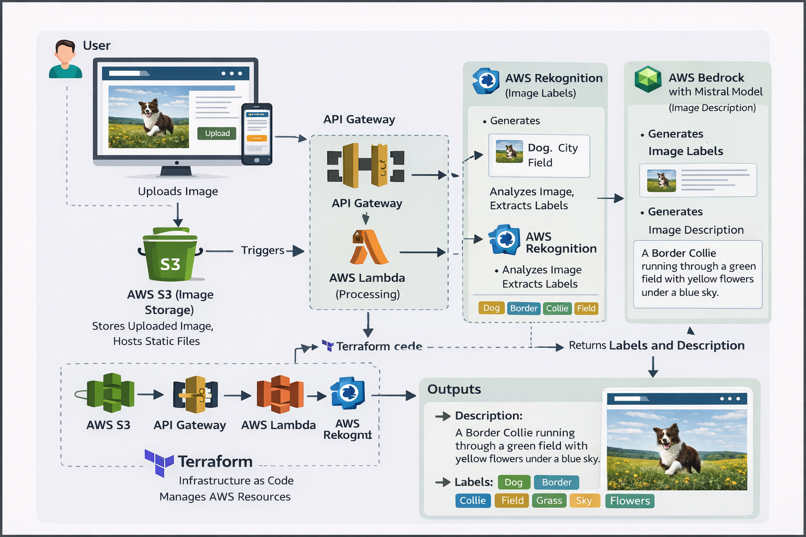
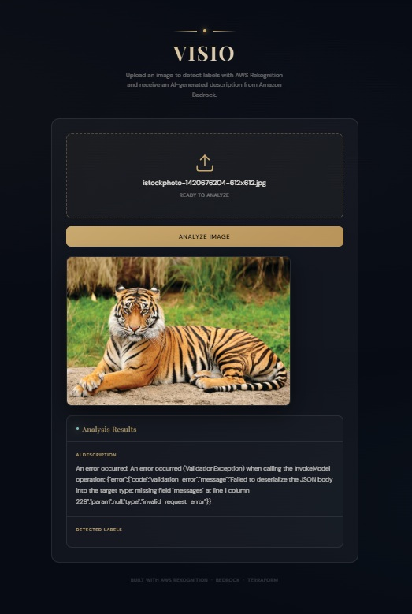

# VISIO — AI Image Analyzer

**VISIO** is a cutting-edge serverless web application that leverages AWS's advanced AI services to provide intelligent image analysis. Built with a focus on automation and scalability, VISIO allows users to upload images and receive both accurate object labels and fluid, context-aware natural language descriptions.

---

## 🏗️ Architecture Overview

The project follows a modern **Serverless Architecture** pattern, entirely provisioned and managed via **Infrastructure as Code (Terraform)**.



### The Request Flow:
1. **Frontend**: A sleek, responsive web interface (hosted on **S3**) allows users to upload local images.
2. **API Gateway**: Acts as the secure entry point, routing POST requests to the backend logic.
3. **AWS Lambda**: Processes the image (Base64), interfacing with AI services.
4. **Amazon Rekognition**: Performs deep learning-based image analysis to detect objects and labels.
5. **Amazon Bedrock (DeepSeek V3)**: Translates technical labels into a natural, descriptive English sentence.

---

## 🐯 AI in Action

VISIO doesn't just list objects; it understands the scene. Using **Amazon Rekognition** for detection and **Amazon Bedrock** for narration, it creates a comprehensive summary of any visual input.

**Example Analysis:**


> **Labels Detected:** Tiger, Wildlife, Mammal, Predator, Cat.
> **AI Description:** "A majestic tiger prowls through the dense jungle undergrowth, its stripes camouflaged against the shadows."

---

## 🚀 Key Features

- **Automated Image Labeling**: High-confidence object detection using AWS Rekognition.
- **Generative AI Narrations**: Real-time descriptive text generation via Amazon Bedrock (DeepSeek V3 model).
- **Fully Serverless Stack**: No servers to manage, scales automatically with demand.
- **Infrastructure as Code**: 100% of the AWS environment is defined in Terraform for consistency and portability.
- **Premium UI/UX**: A modern, glassmorphic frontend designed for a seamless user experience.

---

## 🛠️ Technical Stack

- **Cloud Provider**: AWS (Amazon Web Services)
- **Infrastructure**: Terraform (HCL)
- **Backend Logic**: AWS Lambda (Python 3.9)
- **AI/ML Services**:
  - **Amazon Rekognition** (Computer Vision)
  - **Amazon Bedrock** (LLM Orchestration)
- **API Layer**: AWS API Gateway (REST)
- **Storage/Hosting**: Amazon S3 (Static Website Hosting)
- **Frontend**: HTML5, Vanilla CSS3 (Custom Design System), JavaScript (ES6+)

---

## 📦 Setup & Deployment

### Prerequisites
- [Terraform](https://www.terraform.io/downloads.html) installed.
- [AWS CLI](https://aws.amazon.com/cli/) configured with appropriate credentials.

### Steps to Deploy
1. **Clone the Repository:**
   ```bash
   git clone <your-repo-url>
   cd VISIO
   ```

2. **Initialize Infrastructure:**
   ```bash
   cd terraform
   terraform init
   terraform apply
   ```

3. **Configure Frontend:**
   - Note the `frontend_website_url` from the Terraform output.
   - Update the `API_ENDPOINT` in `frontend/index.html` with your deployed API Gateway URL.

4. **Upload to S3:**
   Upload the `index.html` file to the generated S3 frontend bucket.

---

## 👨‍💻 About My Work
This project demonstrates my ability to integrate complex Cloud Services (AWS) with modern Development practices (IaC) and the latest AI advancements. If you're looking for an engineer who can bridge the gap between infrastructure and intelligent application logic, let's connect!

---

